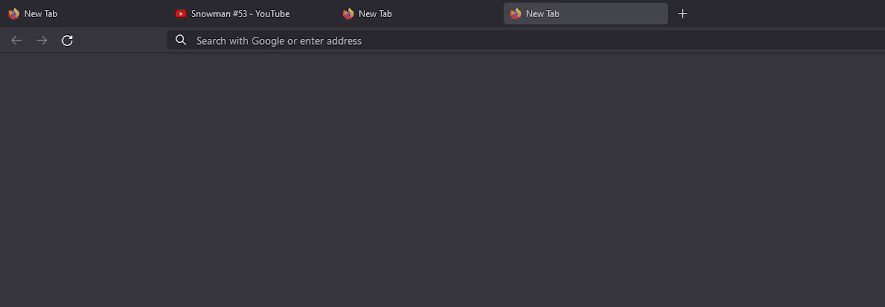
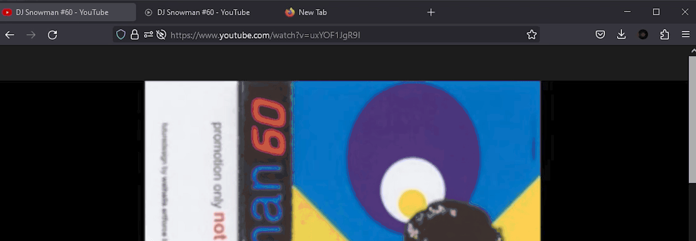
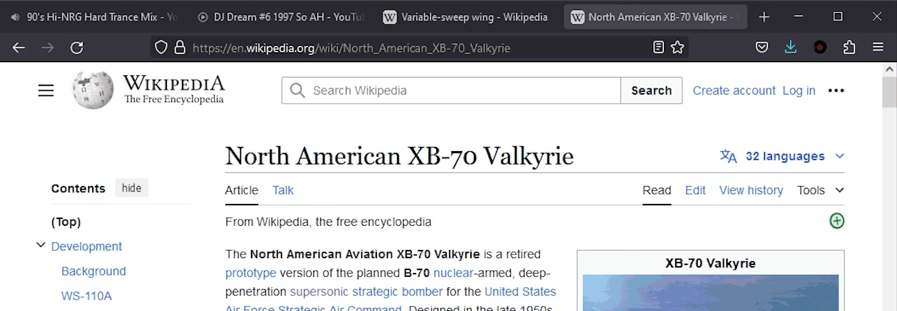

## Description

The following user style modifies Firefox's design language. Repurposing the area for the tab's favicon into an action zone, reducing the amount of actions that appear on tabs, while also aiming to reduce overall eye movement. The idea is this will result in less distractions, by having less buttons for your eyes to track. Additionally leveraging transitions and animations in an effort to sustain focus and follow through with their actions.

### Features

- Favicon changes have been smoothed out
- Tab close icon is only shown on hover
  - Replaces favicon
- When the tab's title overflows a marquee effect will be applied
  - Animation starts after hovering over the tab for 600 ms
- CSS Variables to customize delays/durations

### Notes

- This was created using Firefox 124.0.2
- Legacy customization needs to be enabled [⦗Guide⦘](./guides/enable-userstyles/enabling-userstyles)
- Set the UI density to compact for the best experience [⦗Guide⦘](./guides/compact-ui/enable-compact-ui.md)

### Preview

| Title             |                               Preview                               |
| :---------------- | :-----------------------------------------------------------------: |
| Favicon tab close |   |
| Media Icons       |  |
| Marquee           |      |
