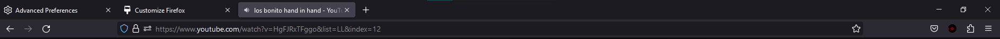

## Enabling compact mode

1. Navigate to [about:config](about:config)

2. Copy the string below and paste it in the search bar search bar on the previous page

```bash
 browser.compactmode.show
```

3. Click on the result, change it value to true


4. Right click on the tab bar and open 'Customize Toolbar'


5. At the bottom right a new UI density option will be available


## Comparison

#### Before


#### After


