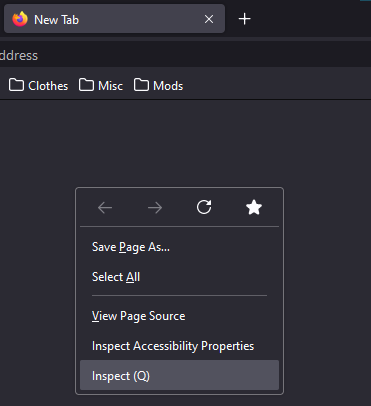
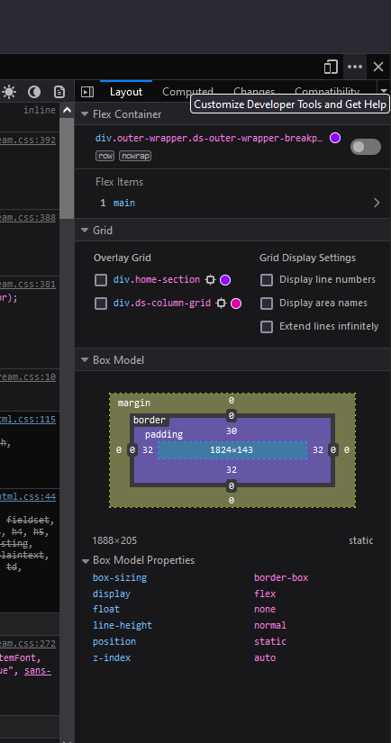
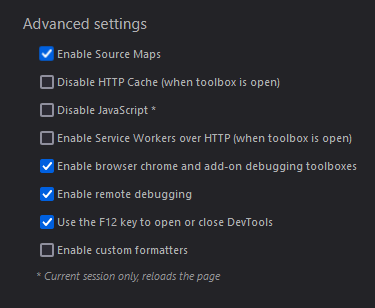

Open the regular develop toolbox by pressing 'crtl+shift+i' or by opening the context menu on the new tab page and selecting inspect

 

Now press 'f 1' to open the developer tool settings page, you can also click on the ellipses icon on the right hand side and select the 'Settings' option.

 

Under the 'Advanced settings' section enable 
- Enable browser chrome and add-on debugging toolboxes
- Enable remote debugging

 

Press 'crtl+alt+shift+i' to open the developer toolbox for the browser itself

A popup will display warning you about the incoming connection, read the all the information before clicking ok. If you click disable you will need to re-enable the previous settings