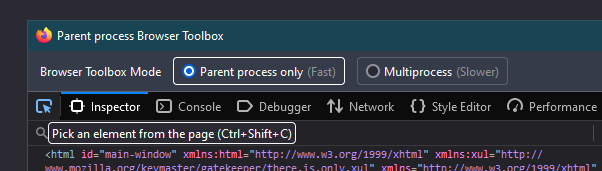
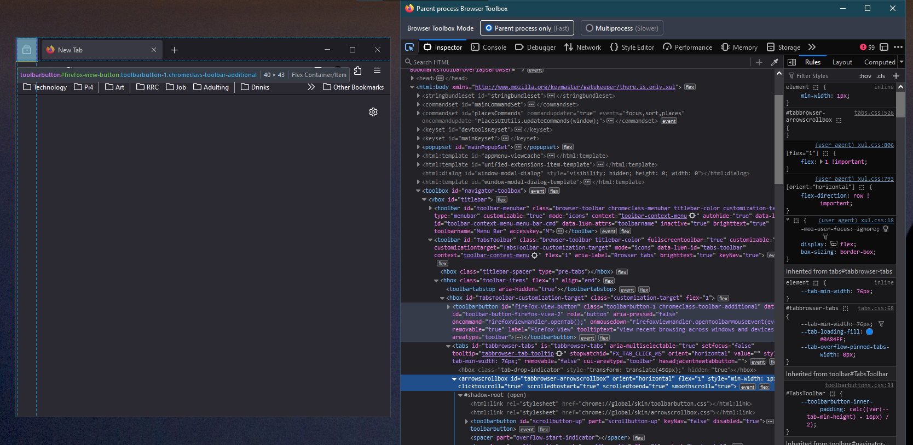
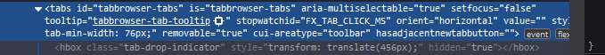
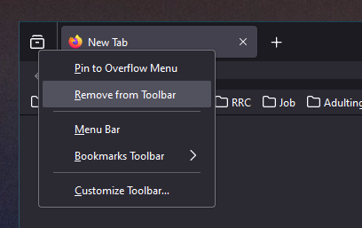

## Removing the tab list icon from Firefox

Here are the step by step instructions to remove the useless tab list icon.

### Prerequistes

- The Browser Toolbox needs to be enabled [⦗Guide⦘](../dev-toolbox/enabling-browser-developer-toolbox.md)

### Guide

1. Start off by opening the browser toolbox with 'crtl+alt+shift+i'

2. Select the element picker tool



3. Click on the tab list icon

4. In the following screen shot the element picker tool is being used to select the tab list icon, the mouse is only hovering and has not selected the element.



5. Once the tab list is selected the browser toolbox will update and highlight the element. Change the 'removeable' attribute to true, apply the changes by pressing enter. This will restore the 'remove' button's functionality.


> [!IMPORTANT]
> When you hit enter the element should look like this.
>
> 

6. Right click on the tab list icon, click on remove.



## Other changes

There might be a left over gap in place of the tab list. You can add the following CSS to your userChrome file

> [!TIP]
> INSERT_GUIDE_LINK

```css
/*  Remove spacing from the tab list icon */
.titlebar-spacer[type="pre-tabs"],
.titlebar-spacer[type="post-tabs"] {
	display: none;
}
```
