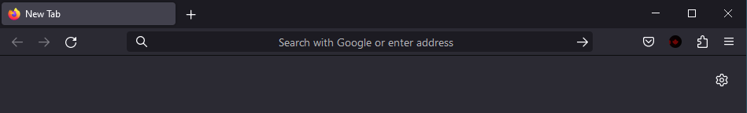
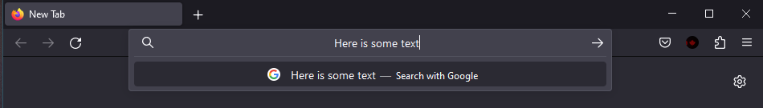
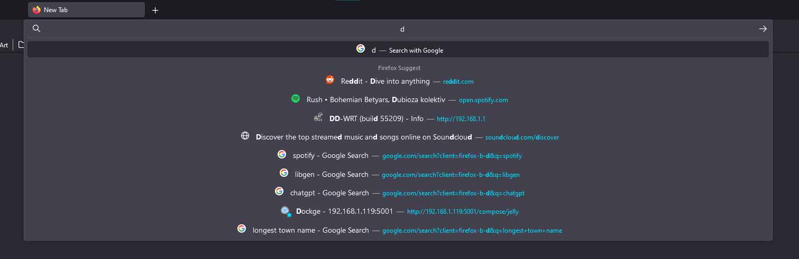
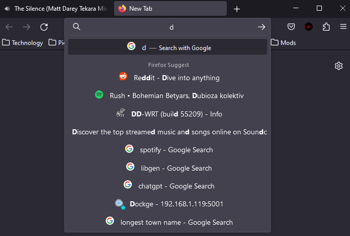

## Description

Centers the address bar contents, favicons and title/url.

### Notes

- The "right arrow icon" will always be displayed, otherwise the address text jumps to the right on focus

### Preview

| Title             |                                                                            Preview                                                                            |
| :---------------- | :-----------------------------------------------------------------------------------------------------------------------------------------------------------: |
| Centered inactive |                                                   |
| Searching         |              |
| Results           |  |
| Squished Results  |                                                                                             |
